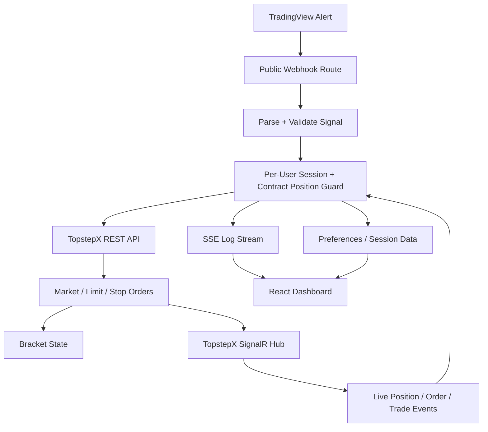

# Nexum

[](https://github.com/Dashtine/Nexum/actions/workflows/ci.yml)

Nexum is a self-hosted, real-time trading automation platform that connects TradingView alerts to TopstepX for futures order execution. It combines a Node.js/Express backend, React frontend, REST integrations, SignalR event streams, JWT authentication, per-user session isolation, bracket-order management, and browser-based monitoring.

## At a Glance

| Area | Details |
|---|---|
| Frontend | React, Vite, Tailwind CSS |
| Backend | Node.js, Express, JWT, bcrypt |
| Real-time | SignalR + Server-Sent Events |
| Integrations | TopstepX REST API, TopstepX SignalR hub, TradingView webhooks |
| Architecture | per-user sessions, contract-scoped state, bracket-order coordination |

## Engineering Highlights

- **Node.js + Express backend** for authentication, REST endpoints, webhook ingestion, user sessions, and order workflows
- **React + Vite frontend** for connection management, saved profiles, testing tools, live logs, and candle-data export
- **TopstepX REST API integration** for authentication, account discovery, contract lookup, market history, and order placement
- **SignalR integration** for live position, order, and trade events
- **JWT authentication** with bcrypt-backed user credentials and per-user backend session isolation
- **Contract-scoped position guards** so multiple symbols can be handled independently without duplicate entries on the same contract
- **Bracket-order state management** for take-profit and stop-loss coordination
- **Server-Sent Events (SSE)** for real-time application logs
- **Server-side token renewal** so scheduled authentication refreshes continue even when the browser is closed
- **Per-user preferences and log history** for cross-device continuity
- **Historical candle export** with pagination, timestamp conversion, deduplication, and CSV generation

## Architecture



## What This Project Demonstrates

Nexum focuses on modern full-stack and real-time application engineering:

- separating API, authentication, order, real-time, and session concerns into backend modules
- maintaining isolated runtime state for multiple users and contracts
- combining REST commands with SignalR events and SSE browser updates
- designing authentication and credential boundaries for a self-hosted application
- building a React interface around asynchronous backend state
- validating third-party API behavior and iterating on failure cases

## Repository Structure

### Backend (`/backend`)

- `src/server.js` - Express entry point, authentication routes, SSE logging, health check, and graceful shutdown
- `src/nexumAuth.js` - JWT verification and bcrypt-backed user authentication
- `src/sessions.js` - per-user runtime session state
- `src/routes/api.js` - authenticated API routes for connection management, status, preferences, token refresh, and candle data
- `src/routes/webhook.js` - TradingView alert validation, duplicate-position protection, and order flow
- `src/alertParser.js` - isolated alert parsing used by the webhook flow and automated tests
- `src/topstepx/auth.js` - TopstepX authentication and token lifecycle
- `src/topstepx/orders.js` - account, contract, position, and order operations
- `src/topstepx/signalr.js` - real-time user hub connection and event handling
- `src/topstepx/brackets.js` - bracket-order tracking
- `src/topstepx/state.js` - in-memory position state and contract-scoped lookups
- `src/logs.js` - SSE broadcast and server-side log history

### Frontend (`/frontend`)

React + Vite + Tailwind CSS single-page application with reusable hooks for connection state, logs, preferences, theme, and profile management.

## How It Works

1. A user signs into Nexum and connects a TopstepX account and contract.
2. The backend authenticates with TopstepX, resolves the account and contract, seeds open-position state, and connects to the SignalR user hub.
3. TradingView sends an alert to the user's webhook endpoint.
4. Nexum parses and validates the signal, checks for an existing position on that contract, and places the entry and exit orders.
5. SignalR events keep position and order state synchronized in real time.
6. Logs are streamed to the React dashboard through SSE.

## Webhook Format

Nexum accepts alerts in this format:

```text
Position: BUY
Contracts: 1
Take Profit: 24700.00
Stop Loss: 24645.25
```

| Field | Required | Description |
|---|---|---|
| `Position` | Yes | `BUY` or `SELL` |
| `Contracts` | Yes | Number of contracts |
| `Take Profit` | Yes | Exit limit price |
| `Stop Loss` | Yes | Exit stop price |

Test signals can use tick-based brackets:

```text
TEST
Position: BUY
Contracts: 1
TpTicks: 40
SlTicks: 20
```

## Security

- `.env` files are excluded from Git
- `JWT_SECRET` is required at startup and has no hardcoded production fallback
- webhook authentication can be enabled with `WEBHOOK_SECRET`
- local user credential files and per-user application data are excluded from Git
- passwords are stored as bcrypt hashes rather than plaintext

Copy `backend/.env.example` to your local environment configuration and provide your own secrets. Never commit real TopstepX credentials, JWT secrets, or webhook secrets.

## Development Approach

Nexum was built using an AI-assisted development workflow. I defined the product requirements and system behavior, made architecture and integration decisions, reviewed implementation output, debugged API and real-time-event issues, validated behavior against TopstepX, and tested the application while using Claude Code to accelerate implementation and iteration.

The goal of the project was not simply to generate code, but to use AI tooling as part of an engineering workflow while retaining responsibility for requirements, technical decisions, validation, and debugging.

## Tech Stack

**Frontend:** React, Vite, Tailwind CSS, JavaScript  
**Backend:** Node.js, Express, JWT, bcrypt  
**Real-time:** SignalR, Server-Sent Events  
**Integrations:** TopstepX REST API, TopstepX SignalR hub, TradingView webhooks

## Running Locally

Backend:

```bash
cd backend
npm install
npm run dev
```

Frontend:

```bash
cd frontend
npm install
npm run dev
```

The backend requires environment values such as `JWT_SECRET` and any TopstepX/webhook credentials used by your local setup.

## Project Status

Nexum is an independently directed full-stack engineering project. It is not financial advice and should not be treated as a production trading service without independent testing, security review, monitoring, and operational controls.
